# 🎓 Little English Hero

  
  

  <b>Ứng dụng học tiếng Anh dành cho trẻ em từ 3–8 tuổi</b>

  Little English Hero biến việc học tiếng Anh thành một cuộc  vui chơi thông qua mini game, hình ảnh sinh động và các bài học tương tác dành cho trẻ em.

  
  
  
  
  

---

# ✨ Giới thiệu

Little English Hero là ứng dụng giáo dục trên nền tảng Android hỗ trợ trẻ em học các từ vựng tiếng Anh cơ bản thông qua phương pháp **Gamification (Trò chơi hóa)**.

Ứng dụng được thiết kế với giao diện đầy màu sắc, trực quan và thân thiện nhằm giúp trẻ:

* 📚 Ghi nhớ từ vựng dễ dàng hơn
* 🎮 Học thông qua trò chơi tương tác
* 🔊 Luyện nghe và phát âm tiếng Anh
* 🏆 Tăng động lực học với hệ thống điểm thưởng và streak

---

# 🌟 Tính năng nổi bật

## 🎮 Mini Game học tiếng Anh

* Học từ vựng thông qua các trò chơi tương tác
* Tạo cảm giác vừa học vừa chơi cho trẻ em

## 🔊 Hỗ trợ âm thanh

* Phát âm từ vựng tiếng Anh
* Hỗ trợ trẻ luyện nghe và ghi nhớ tốt hơn

## 🧠 Flashcard học từ mới

* Học bằng hình ảnh minh họa sinh động
* Ghi nhớ từ vựng trực quan

## 🏆 Hệ thống điểm thưởng

* Theo dõi điểm số và tiến trình học
* Tăng động lực học tập cho trẻ

## ☁️ Đồng bộ dữ liệu

* Sử dụng Cloud Firestore để lưu trữ dữ liệu người dùng
* Hỗ trợ đăng nhập và đồng bộ tiến trình học

---

# 📱 Giao diện ứng dụng

## 🚀 Màn hình chờ và đăng nhập

    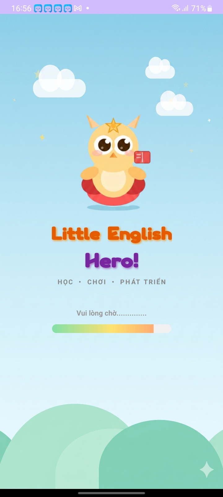
    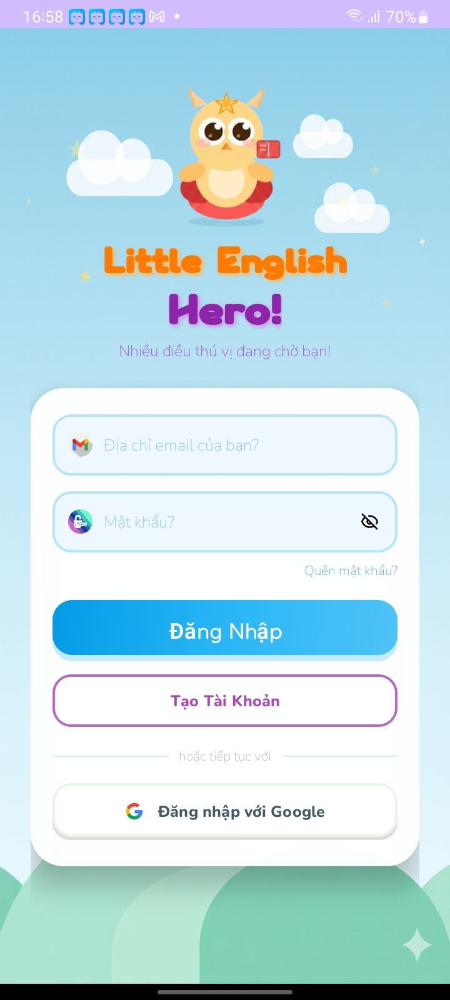
    

---

## 🏠 Màn hình trang chủ, thành tựu và cài đặt

    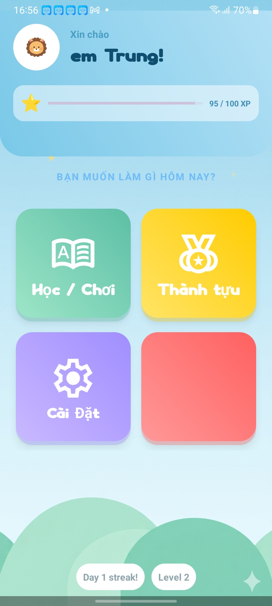
    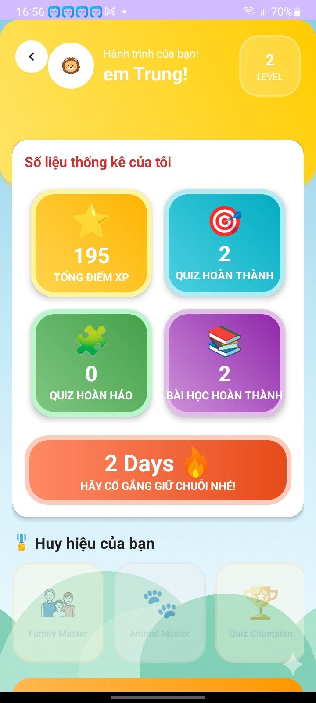
    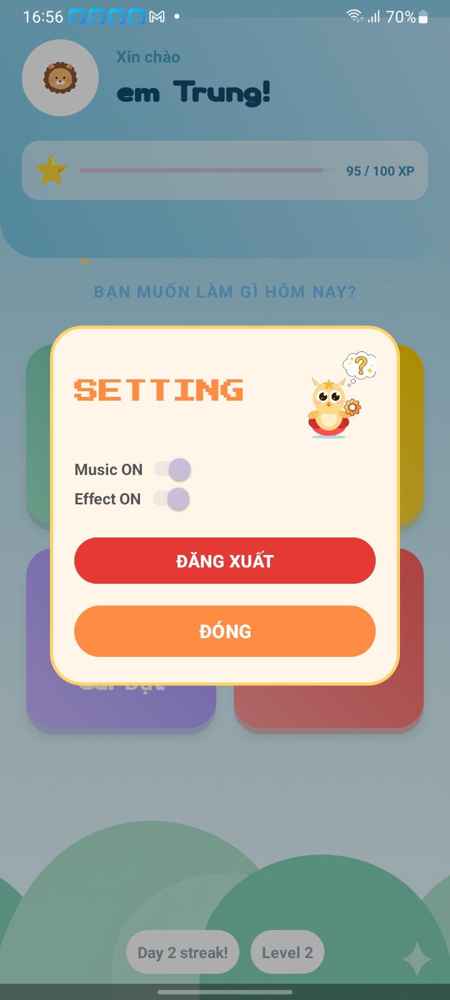

---

## 📚 Màn hình các bài học, flashcard và thông báo

    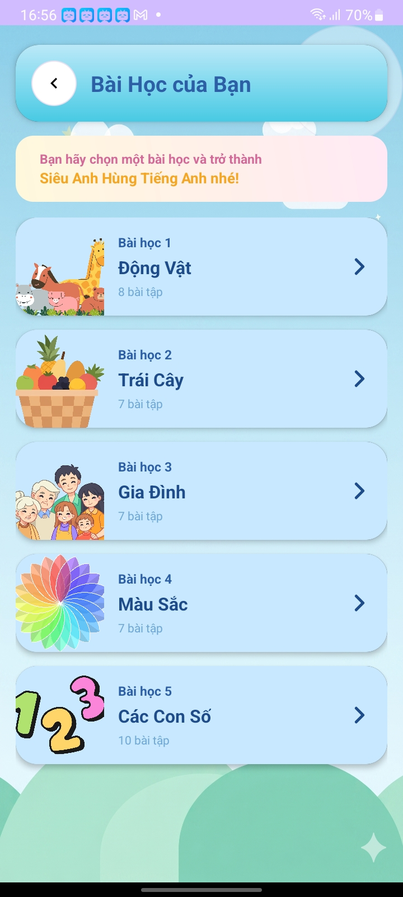
    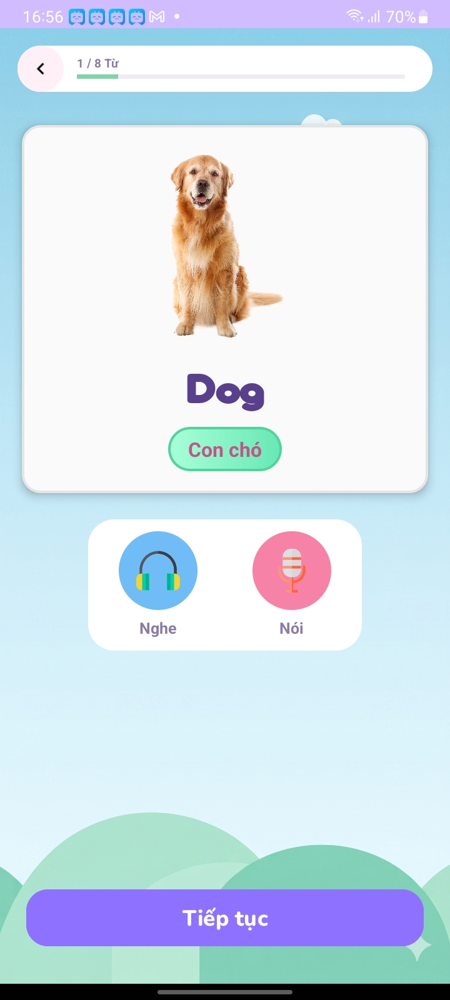
    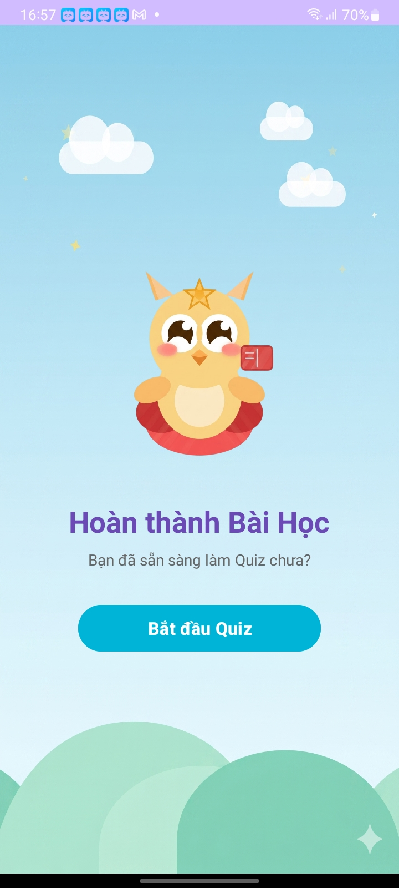

---

## 🧩 Màn hình Quiz translate, images và kết quả

    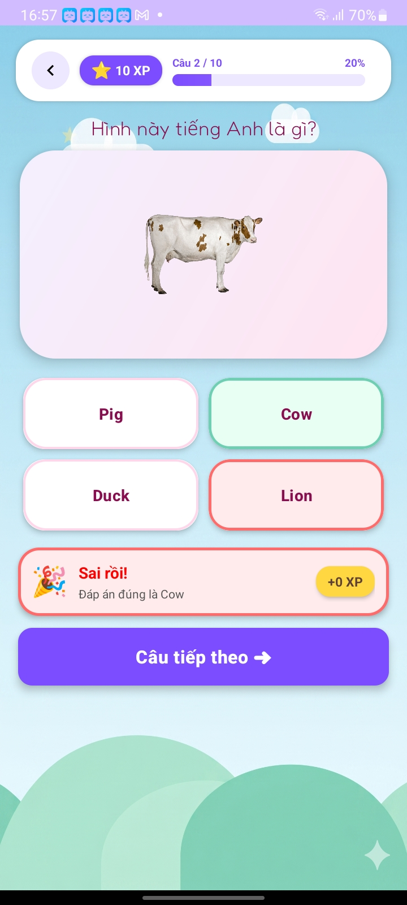
    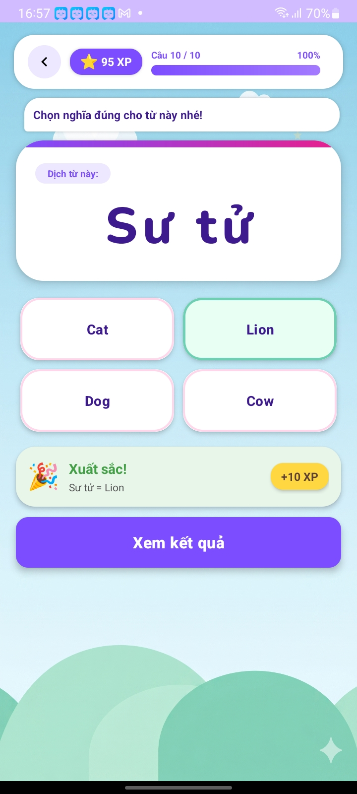
    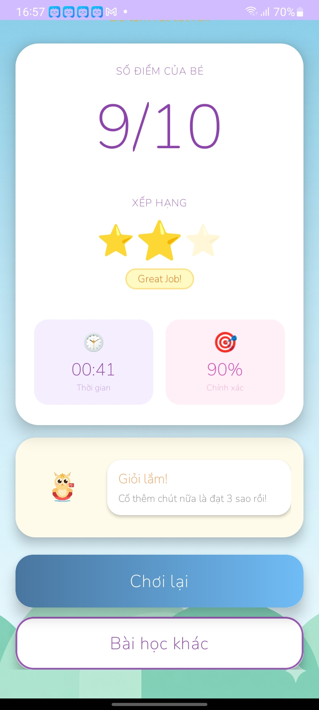

---

# 🛠 Công nghệ sử dụng

| Công nghệ                  | Mô tả                          |
| -------------------------- | ------------------------------ |
| ☕ Java                    | Ngôn ngữ lập trình chính       |
| 📱 Android Studio          | Môi trường phát triển ứng dụng |
| 🔥 Firebase Authentication | Đăng nhập người dùng           |
| ☁️ Cloud Firestore         | Lưu trữ dữ liệu thời gian thực |
| 💾 SQLite                  | Lưu trữ dữ liệu cục bộ         |
| 🎨 XML                     | Thiết kế giao diện người dùng  |

---

> 📚 Dự án được phát triển nhằm phục vụ cho mục đích học tập lập trình ứng dụng di động trên nền tảng Android.